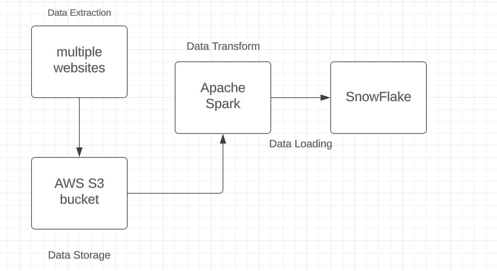
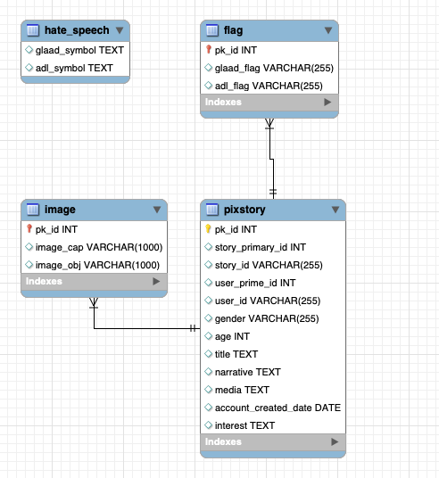

# ETL Data Pipeline

### Topic
This project would perform data ETL process with Pixstory datasets. Here shows the workflow of this project:

---
### Data extraction

#### Original dataset -- Pixstory dataset

The original dataset I used in this project is PixStory dataset. The data are extracted from __[PixStory website](https://www.pixstory.com/)__. The reason why I choose this dataset is because it is a rich dataset with high variation in its features and properties. The discussed topics include sports, entertainment, politics, health, food, environment, history, education, science, and inequality. Given the age breakdown in terms of the data, and genders, these topics can help us decipher clues and questions about the users posting on the platform and their ancillary and other interests. Another reason is that the dataset is focused on clean social media, and not on toxic energy or topics that plague the other platforms. The goal eventually for Pixstory is to minimize hate speech on the platform and instead focus on positive energy and discussions.

The dataset is approximately 100MB unzipped and it contains 95, 000 rows of data and 11 columns, dating from Janurary 2020 to December 2022. The dataset is named "pixstory_ori.csv". The columns are as follows:
* Story Primary ID (a string readable story that can be used to aggregate Stories)
* User Primary ID (a string readable user ID that can be used to aggregate user posts)
* User ID (a numerical user identifier that uniquely identifies the user)
* Gender (Male, Female, Unspecified / null, Other) 
* Age (Age of the person making the post)
* Title (the title of the posted Story, or post within the story)
* Narrative (the text of the post within the story, analogous to e.g., the text body of an Instagram or Facebook post)
* Media (a URL pointer to the associated media with this post)
* Account Created Date (the date that the user made the post from this particular account)
* Interest (a string separated list of interests associated with the post; users must identify what topic or interest their post is about)

#### Additional datasets
**Tools: Apache Tika, Tika Image Dockers**

**Packages: BeautifulSoup, Pandas, Numpy, Requests**

1. Sports event and Film festival datasets
- The Sports event datatset and Film festival datasets are scraped from reliable websites(see websites link in reference). There are two different ways used for scrapping data. The first way is scraped by using BeautifulSoup and the second way is using tika parser to extract information from PDF files. Both ways are efficient and you could choose from these two ways on what kind of data scources you have.  
- Moreover, we processed the data by adding years and organizing the date format. Then, we inserted the event name from these datasets into the Pixstory dataset by filtering the creating time. As a result, we added new columns "Sport Event" and "Festival Event" to the Pixstory dataset.

2. GLAAD, ADL, and sarcasm datasets
- We used the same way as above to scrap the GLAAD, ADL dataset which contains terms of hate speech. The datasets are named as "hate_speech.csv". We would later detect whether these hate speech terms appeared in the posts narrative or not in Spark. 

3. Image dataset
- The image dataset contains all 95,000 images that would match to each post in the Pixstory dataset. To access the images, use the URL from the post and give it the URL prefix “/optimized”. For example, https://image.pixstory.com/optimized/Pixstory-image-164416629024955.jpeg. We wrote a Python program "q7image.py" to download all the images to our local computers. The folder contains all the image is real large, so we would not upload images to the repository. If you are interested about the images, you could run the code to access them.

- After downloaded all the images, we would run Tika Image Dockers on the server to generate image caption and image objects. The dockers would use machine learning and deep learning skills to describe the image content and detect the objects inside the image. Here is an example, after running the dockers on the image shown below, the image caption is generated as *"a group of people on a boat in the water"* and the image objects are *"lakeside, lakeshore, bathing cap"*. The generated captions and objects are not perfectly accurate, but we think it could show the basic information of the images at some extend. 

  

- Finally, the dataset "image_rec.csv" is added. 

---
### Transform datasets
1. Data cleaning
- Since data o of the "title" and "narrative" columns in the original pixstory exhibits several complexities, including the presence of HTML-like elements, emojis, and a multitude of languages from around the world that pose recognition challenges, we first clean the data using Python.

2. Data processing and manipulation

- After completing the data cleaning process, we proceed to ingest each dataset into Spark, ensuring that it conforms to the required format for seamless integration with our target data warehouse during the subsequent loading phase.

- For ADL and GLAAD dataset, we use Spark to try to find out whether the "narrative" and "title" columns contains hate speech terms or not. This process is chanllenging beacuse it istime consuming and the two datasets are highly unbalanced. The hate sppech terms in ADL and GLAAD datasets are only about 300 rows while the "narrative" and "title" columns contains over 95,000 rows. To solve this problem, we gave more memory space to Spark and also perfom broadcasting on ADL and GLAAD datasets. 

--- 
### Loading datasets
- The data warehouse we choose in this project is Snowflake. We first create warehouse and run SQL query in snowflake to create the database and tables. After that we connected Spark to Snowflake and load the dataframe from Spark to Snowflake.

The below shows the SQL schema:

---
### Orchestra data ETL workflow

- After completed the implementation of data ETL, we also applied Airflow to shedule the workflows. 

---
### Conclusions

- In this project, we successfully extracted Pixstory datasets, transform and load them to Snowflake. We could then perform advanced SQL like query and data anlyses based on Snowflake. 

### References

- Course materials from USC DSCI550 by Christian Mattnmann, including the original Pixstory datatset.
- “2020 World Sporting Event Calendar”, 2020, https://www.topendsports.com/events/calendar-2020.htm
- “2021 World Sporting Event Calendar”, 2021, https://www.topendsports.com/events/calendar-2021.htm
- “2022 World Sporting Event Calendar”, 2022, https://www.topendsports.com/events/calendar-2022.htm
- “Film Festival Database”, 2020, https://www.filmfestivaldatabase.com/
- “2021 film festivals and markets: latest dates, postponements and cancellations”, 2021, https://www.screendaily.com/news/2021-film-festivals-and-markets-latest-dates-postponements-andcancellations/5155284.article
- “2022 Film Festival Dates”, 2022, https://www.film-fest-report.com/home/film-festivals-2022
- GLAAD : https://www.glaad.org/hate-speech-listing
- ADL: https://www.adl.org/resources/hate-symbols/search
- sarcasm: https://nlds.soe.ucsc.edu/sarcasm

